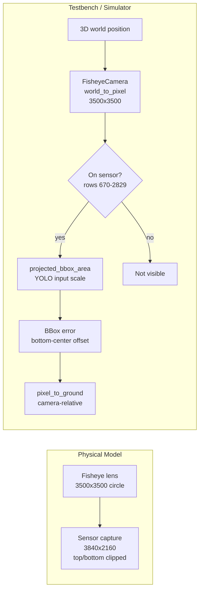

<h1 align="center">BIKEPED</h1>

<p align="center">
  <strong>Real-time pedestrian–cyclist collision warning for urban intersections.</strong><br/>
  30 FPS response system designed for Jetson Orin devices.
</p>

<p align="center">
  <a href="https://arxiv.org/abs/2604.17046"></a>
  <a href="https://huggingface.co/datasets/mehmetkeremturkcan/bikeped"></a>
  <a href="https://mkturkcan.github.io/bikeped/"></a>
  <a href="https://github.com/mkturkcan/bikeped"></a>
  
  
</p>

<p align="center">
  <a href="https://arxiv.org/abs/2604.17046">📄 Paper</a> ·
  <a href="https://huggingface.co/datasets/mehmetkeremturkcan/bikeped">🤗 Dataset</a> ·
  <a href="https://mkturkcan.github.io/bikeped/">📖 API docs</a> ·
  <a href="https://mkturkcan.github.io/bikeped/simulator/">🎮 Simulator</a> ·
  <a href="bridge_starter/">🛠️ Adaptation kit</a> ·
  <a href="#reproduce-paper-results">🔁 Reproduce</a>
</p>

---

## What's in this repo

| | |
|---|---|
| **`bridge_starter/`** | Drop-in adaptation kit. One self-contained script with a USER CONFIG block at the top, a simulated indicator light, optional sounds, and an auto-downloaded YOLO11xxl detector. Start here if you want to deploy on a different intersection. |
| **`simulator/index.html`** | Interactive browser-based testbench (no install — open the file). Renders the decision pipeline live with all 24 conformance scenarios and the seven pipeline / decision-rule variants from the paper. Hosted at [mkturkcan.github.io/bikeped/simulator/](https://mkturkcan.github.io/bikeped/simulator/). |
| **`decision_pipeline.py` + `decision_testbench.py`** | The three-stage decision logic and the offline scenario runner used for every number in the paper. |
| **`run_experiments.py`** | One command that reproduces every table and figure. |
| **`calibration/`** | Fisheye intrinsic calibration (perspective remap + bundle adjustment). |
| **`tools/`** | Standalone utilities: API doc builder, latency report, model evaluator. |
| **`config.yaml` + `camera_calibration.json`** | Runtime parameters and calibrated intrinsics from the deployed system. |

The companion dataset (24 conformance scenarios with paired schematic + CARLA-photorealistic videos and per-frame ground-truth danger labels) lives on Hugging Face: [`mehmetkeremturkcan/bikeped`](https://huggingface.co/datasets/mehmetkeremturkcan/bikeped).

## Install

Python ≥ 3.10. CUDA-capable GPU recommended for real-time throughput.

```bash
pip install -r requirements.txt
```

The deployed live MQTT bridge for the production system isn't included here — see [`bridge_starter/`](bridge_starter/) for a slim, self-contained version that any team can adapt to a new intersection.

## Reproduce paper results

One command runs every experiment in the paper and writes every figure:

```bash
python run_experiments.py                   # full pipeline (~45 min)
python run_experiments.py --skip-optimizer  # skip optimizer (~10 min)
```

Run an individual experiment:

```bash
python decision_testbench.py --compare                  # Table 2 (with fisheye localization error)
python decision_testbench.py --no-bbox-noise --compare  # ablation without localization error
python decision_testbench.py --latency-sweep            # Figure 4 (latency sweep)
python decision_testbench.py --monte-carlo --mc-trials 50
python decision_testbench.py --optimize                 # differential evolution (~30 min)
python decision_testbench.py --error-map                # bounding-box error map
python run_height_pitch_sweep.py                        # Figure 8b (~30 min)
python generate_figures.py                              # all publication figures
python sim_visualizer.py --no-display                   # render scenario MP4s
```

## Adapting the bridge to a new deployment

Copy [`bridge_starter/`](bridge_starter/) into your own project, then:

1. Edit the **USER CONFIG** block at the top of [`bridge.py`](bridge_starter/bridge.py): camera intrinsics, MQTT broker, sound paths, model name.
2. (First run only) the script downloads `yolo11xxl.pt` from Hugging Face and tries to export it to a TensorRT engine.
3. `python bridge.py`.

The kit ships a `SimulatedLight` (prints colour transitions to stdout) so the system runs end-to-end without any indicator hardware. Sounds are optional and skipped silently if the WAV files are missing. See [`bridge_starter/README.md`](bridge_starter/README.md) for the full guide, including how to tune `DEC_PROX_MIN_M` and the rider-on-bike suppression for your detector and camera geometry.

## Perception pipeline

The testbench replicates the geometry of the deployed system end-to-end:



`FisheyeCamera` in [`decision_testbench.py`](decision_testbench.py) implements the equidistant model `r = f·θ` with optional Kannala–Brandt-style `k1`, `k2` polynomial terms loaded from `camera_calibration.json`. Forward and inverse projections agree to floating-point precision, and match the deployed ground-coordinate LUT bit-for-bit when both run from the same `camera_calibration.json`.

## Decision pipeline

Three stages evaluated in sequence:

1. **Pedestrian presence** — no pedestrian = `IDLE`.
2. **Cyclist memory** — no cyclist in last *N* frames = `SAFE`.
3. **Pairwise closing check** — for each bike–ped pair within `[d_min, d_max]`, compare pairwise distance at frame *t* vs *t − k* using both agents' historical positions. Closing + cyclist moving = `ALERT`.

Selected parameters (optimizer-derived): `N=58` frames, `d=[1.9, 24.8]` m, lookback `k=2`, speed-adaptive `d_max`. Braking model uses 85th-percentile field measurements (PRT = 0.84 s, decel = 1.96 m/s²).

## Conformance scenarios

24 scripted scenarios covering:

| Category               | Scenarios |
|:-----------------------|:---------:|
| Safe crossings         | 3 |
| Standard approaches    | 5 |
| High-speed / accelerating | 3 |
| Accessibility          | 2 |
| Multi-agent            | 3 |
| Edge cases             | 3 |
| Non-linear trajectories | 4 |

21 of the 24 contain ground-truth danger intervals. The E-Scooter and Accelerating E-Bike scenarios use the e-bicycle braking profile (decel = 6.0 m/s²). Per-frame waypoint paths and danger labels — plus paired schematic + CARLA-photorealistic videos for every scenario — are published as the [bikeped dataset](https://huggingface.co/datasets/mehmetkeremturkcan/bikeped).

## Documentation

Live: **<https://mkturkcan.github.io/bikeped/>** — built with [MkDocs Material](https://squidfunk.github.io/mkdocs-material/) and [mkdocstrings](https://mkdocstrings.github.io), populated from this README plus every module's docstrings. Hosted on GitHub Pages from the [`docs/`](docs/) folder of this repo.

To rebuild locally:

```bash
pip install mkdocs-material "mkdocstrings[python]" pymdown-extensions
python tools/build_docs.py            # builds docs/
python tools/build_docs.py --serve    # live preview on http://localhost:8000
python tools/build_docs.py --open     # build and open in default browser
```

Commit the regenerated `docs/` folder to publish the update.

## Repository layout

```
repo/bikeped/
├── README.md
├── requirements.txt
├── config.yaml                        runtime parameters
├── camera_calibration.json            calibrated intrinsics (read by every script)
├── crosswalks.json                    extracted CARLA crosswalk geometry
│
├── decision_pipeline.py               three-stage decision module (shared)
├── decision_testbench.py              offline evaluation, optimizer, Monte Carlo
├── sim_visualizer.py                  renders scenario MP4s
├── generate_figures.py                publication figures (EPS / PDF)
├── run_experiments.py                 one-command paper reproduction
├── run_height_pitch_sweep.py          height-pitch placement sweep
├── carla_scenario.py                  CARLA scenario runner
├── crosswalk_analysis.py              deployment / road-width analysis
│
├── calibration/                       fisheye calibration tools
│   ├── calibrate_fisheye.py           checkerboard + bundle adjustment
│   ├── capture_calibration.py         live camera frame capture
│   └── compare_fisheye_models.py      fit all four projection models
│
├── tools/                             standalone utilities
│   ├── build_docs.py                  pdoc API-doc builder
│   ├── latency_report.py              per-step latency stats
│   ├── eval_models.py                 YOLO eval on fisheye-augmented COCO
│   └── carla_find_crosswalks.py       crosswalk extractor for CARLA maps
│
├── simulator/                        interactive browser testbench
│   └── index.html                    self-contained HTML/JS (open in any browser)
│
└── bridge_starter/                   drop-in adaptation kit (self-contained)
    ├── README.md
    ├── bridge.py                     slim live system with USER CONFIG block
    ├── decision_pipeline.py          (mirror of the top-level file)
    ├── requirements.txt
    └── .gitignore
```

## Citation

If you use this code or the scenario dataset, please cite:

```bibtex
@misc{turkcan2026realtimebikepedestriansafetywideangle,
  title         = {A Real-Time Bike-Pedestrian Safety System with Wide-Angle Perception and Evaluation Testbed for Urban Intersections},
  author        = {Mehmet Kerem Turkcan},
  year          = {2026},
  eprint        = {2604.17046},
  archivePrefix = {arXiv},
  primaryClass  = {cs.CV},
  url           = {https://arxiv.org/abs/2604.17046}
}
```

Paper: <https://arxiv.org/abs/2604.17046> · Dataset: <https://huggingface.co/datasets/mehmetkeremturkcan/bikeped>
