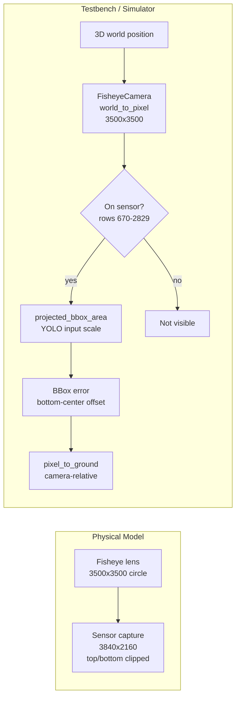

# bikeped

<p align="center">
  <a href="https://github.com/mkturkcan/bikeped"></a>
  
  
  
  
</p>

Real-time pedestrian–cyclist collision warning for urban intersections. Runs on a single edge device (NVIDIA Jetson Orin) with a wide-angle fisheye camera, producing audible and visual alerts at 30 fps with ~30 ms processing latency.

Companion code for the technical report *A Real-Time Bike–Pedestrian Safety System with Wide-Angle Perception and Evaluation Testbed for Urban Intersections*.

---

## Contents

- [Install](#install)
- [Reproduce paper results](#reproduce-paper-results)
- [Perception pipeline](#perception-pipeline)
- [Decision pipeline](#decision-pipeline)
- [Conformance scenarios](#conformance-scenarios)
- [Configuration](#configuration)
- [API documentation](#api-documentation)
- [Repository layout](#repository-layout)
- [Citation](#citation)

---

## Install

Python ≥ 3.10 is required. Install dependencies from the pinned list:

```bash
pip install -r requirements.txt
```

The deployed live system (perception + MQTT bridge on the Jetson) is not included in this repository.

## Reproduce paper results

One-command reproduction of every table and figure in the paper:

```bash
python run_experiments.py                   # full pipeline (~45 min)
python run_experiments.py --skip-optimizer  # skip optimizer (~10 min)
```

Individual experiments:

```bash
python decision_testbench.py --compare                  # Table 2 (with fisheye localization error)
python decision_testbench.py --no-bbox-noise --compare  # ablation without localization error
python decision_testbench.py --latency-sweep            # Figure 4 (latency sweep)
python decision_testbench.py --monte-carlo --mc-trials 50
python decision_testbench.py --optimize                 # differential evolution (~30 min)
python decision_testbench.py --error-map                # bounding-box error map
python run_height_pitch_sweep.py                        # Figure 8b (~30 min)
python generate_figures.py                              # all publication figures
python sim_visualizer.py --no-display                   # render scenario MP4s
```

## Perception pipeline

The testbench replicates the geometry of the deployed system end-to-end:



`FisheyeCamera` in `decision_testbench.py` implements the equidistant model `r = f·θ` with optional Kannala–Brandt-style `k1`, `k2` polynomial terms loaded from `camera_calibration.json`. Forward and inverse projections agree to floating-point precision, and match the deployed ground-coordinate LUT bit-for-bit when both run from the same `camera_calibration.json`.

## Decision pipeline

Three stages evaluated in sequence:

1. **Pedestrian presence** — no pedestrian = `IDLE`.
2. **Cyclist memory** — no cyclist in last *N* frames = `SAFE`.
3. **Pairwise closing check** — for each bike–ped pair within `[d_min, d_max]`, compare pairwise distance at frame *t* vs *t − k* using both agents' historical positions. Closing + cyclist moving = `ALERT`.

Selected parameters (optimizer-derived): `N=58` frames, `d=[1.9, 24.8]` m, lookback `k=2`, speed-adaptive `d_max`. Braking model uses 85th-percentile field measurements (PRT = 0.84 s, decel = 1.96 m/s²).

## Conformance scenarios

24 scripted scenarios covering:

| Category               | Scenarios |
|:-----------------------|:---------:|
| Safe crossings         | 3 |
| Standard approaches    | 5 |
| High-speed / accelerating | 3 |
| Accessibility          | 2 |
| Multi-agent            | 3 |
| Edge cases             | 3 |
| Non-linear trajectories | 4 |

21 of the 24 scenarios contain ground-truth danger intervals. The E-Scooter and Accelerating E-Bike scenarios use the e-bicycle braking profile (decel = 6.0 m/s²).

## Configuration

All runtime parameters live in [`config.yaml`](config.yaml). The `decision:` block matches the optimizer-derived values deployed on the Jetson.

## API documentation

Browsable HTML docs are generated from the module and function docstrings:

```bash
pip install pdoc
python build_docs.py            # builds docs/
python build_docs.py --serve    # live preview on http://localhost:8080
python build_docs.py --open     # build and open in default browser
```

Output goes to [`docs/`](docs/). Open `docs/index.html` in a browser after building.

## Repository layout

```
decision_pipeline.py       Shared three-stage decision module
decision_testbench.py      Offline evaluation, optimization, Monte Carlo, latency sweep
sim_visualizer.py          Scenario visualization (renders MP4 videos)
generate_figures.py        Publication figure generation (EPS/PDF)
run_experiments.py         Reproduce all paper experiments in one command
run_height_pitch_sweep.py  Height-pitch camera placement Monte Carlo sweep
eval_models.py             YOLO model evaluation on fisheye-augmented COCO
calibrate_fisheye.py       Fisheye lens calibration (checkerboard + bundle adjustment)
capture_calibration.py     Calibration frame capture
carla_scenario.py          CARLA scenario generation
carla_find_crosswalks.py   Crosswalk extraction from CARLA maps
crosswalk_analysis.py      Crosswalk geometry analysis
compare_fisheye_models.py  Fisheye projection model comparison
latency_report.py          Per-frame latency profiling
build_docs.py              API documentation builder (pdoc)
config.yaml                All runtime parameters
camera_calibration.json    Calibrated intrinsics (loaded automatically)
crosswalks.json            Extracted CARLA crosswalk geometry
requirements.txt           Pinned Python dependencies
```

## Citation

If you use this code, please cite the technical report.
